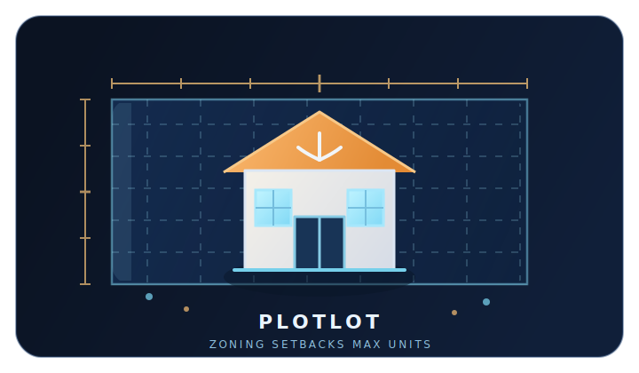

# PlotLot

<p align="center">
  
</p>

PlotLot is an AI-assisted land feasibility platform for acquisition-minded builders, developers, and investors.

Give it a property address and PlotLot helps answer the first question that matters in land: "What can I actually build here?" It resolves the parcel, identifies the governing municipality and zoning context, extracts setbacks and dimensional standards, and calculates the maximum allowable units for the lot. From there, users can move into comps, pro forma, and document workflows.

## Why It Exists

PlotLot came from a very practical bottleneck in land sourcing. Every parcel sits inside a different municipality with its own zoning code, naming conventions, setbacks, overlays, and review process. Manually figuring out what fits on a lot can take too long to be useful at acquisition speed.

PlotLot exists to compress that work:

- address in
- parcel and zoning context resolved
- setbacks and dimensional standards extracted
- maximum allowable units calculated
- optional deeper underwriting layered on top

## Product Flows

### Lookup

Lookup is the quick-feasibility flow.

- Input: a property address
- Goal: fast answers on parcel facts, zoning, setbacks, confidence, and max units
- Output contract: trust-critical facts first, optional deeper analysis second
- UX rule: no free-form chat drift; this flow should stay address-driven and decisive

### Agent

Agent is the higher-capability workflow.

- Input: follow-up questions, strategy questions, document requests, and deeper deal analysis
- Goal: help users reason about a property, compare options, and continue work across sessions
- Product direction: persistent memory, recall of prior conversations, linked reports, and property context
- Current reality: the repo already has agent-mode UX and chat tooling, but durable memory remains an active product direction rather than a finished capability

## What PlotLot Does Today

- Geocodes a property address and resolves municipality and county context
- Pulls parcel and property record data from county/provider sources
- Searches indexed zoning material and extracts dimensional standards
- Calculates governing constraints and maximum allowable units
- Supports follow-on analysis such as comps, pro forma, and document workflows
- Exposes both a structured lookup flow and an agent-style workflow in the frontend

## Current Coverage and Limits

- The strongest current workflow coverage is in South Florida parcel and zoning analysis
- Provider quality and ordinance coverage still vary by municipality
- Trust-critical outputs should always be reviewed alongside cited sources and local professional judgment
- Agent memory and long-lived recall are part of the intended product contract, but not yet fully implemented as durable backend state

## Repository Layout

- [`plotlot/`](/Users/earlperry/Desktop/Projects/EP/plotlot) - main application workspace
- [`plotlot/frontend/`](/Users/earlperry/Desktop/Projects/EP/plotlot/frontend) - Next.js frontend
- [`plotlot/src/plotlot/`](/Users/earlperry/Desktop/Projects/EP/plotlot/src/plotlot) - FastAPI backend, pipeline, providers, and retrieval logic
- [`plotlot/tests/`](/Users/earlperry/Desktop/Projects/EP/plotlot/tests) - unit, integration, and evaluation coverage
- [`plotlot/docs/PLOTLOT_FLOW_CONTRACT.md`](/Users/earlperry/Desktop/Projects/EP/plotlot/docs/PLOTLOT_FLOW_CONTRACT.md) - product, UX, and data contract for Lookup vs Agent
- [`docs/REPO_HISTORY_REWRITE.md`](/Users/earlperry/Desktop/Projects/EP/docs/REPO_HISTORY_REWRITE.md) - collaborator recovery notes for the media purge rewrite

## Quick Start

### Backend

```bash
cd plotlot
uv sync --frozen --dev --extra eval
docker compose up -d db
uv run uvicorn plotlot.api.main:app --host 127.0.0.1 --port 8000
```

### Frontend

```bash
cd plotlot/frontend
npm ci
npm run dev -- --hostname 127.0.0.1 --port 3000
```

Frontend default: `http://127.0.0.1:3000`  
Backend default: `http://127.0.0.1:8000`

## Useful Commands

### Python / backend

```bash
cd plotlot
uv run ruff check src/ tests/
uv run ruff format --check src/ tests/
uv run mypy src/plotlot/ --no-error-summary
uv run pytest tests/unit/ -v --tb=short
uv run pytest tests/integration/test_hub_live.py -m live -v
uv run pytest tests/eval/test_eval_offline.py -m eval -v
```

### Frontend

```bash
cd plotlot/frontend
npm run lint
npm run build
npm run test:ui
npm run test:e2e:no-db
npm run test:e2e:db
```

## Workflow and CI

The repository is set up around three quality lanes:

- PR CI for hygiene, lint, typecheck, unit tests, frontend checks, and Playwright coverage
- Nightly municipality/provider health checks to catch upstream data regressions
- Manual eval workflows for deterministic and optional deeper evaluation runs

Generated screenshots, Playwright reports, and other large test artifacts are intentionally excluded from git. They should live in ignored local directories or GitHub Actions artifacts instead of repository history.

## Branch Workflow

PlotLot should use separate development branches for ongoing work and reserve `main` for approved changes.

- push continuously to `codex/*`, `dev/*`, `feat/*`, `fix/*`, or `hotfix/*` branches
- CI runs on every branch push
- GitHub auto-opens a draft PR from those branches into `main`
- when the work is ready, mark the PR ready for review and collect approval
- merge to `main` only after approval

Branch-flow details and the matching GitHub settings are in [BRANCH_DELIVERY_WORKFLOW.md](/Users/earlperry/Desktop/Projects/EP/docs/BRANCH_DELIVERY_WORKFLOW.md).

## Roadmap Direction

- Durable agent memory and session recall
- Sharper Lookup vs Agent execution contracts
- Better freshness and provenance surfacing for trust-critical facts
- Broader municipality coverage and stronger ingestion governance
- Deeper underwriting and professional workflow support for acquisition teams
