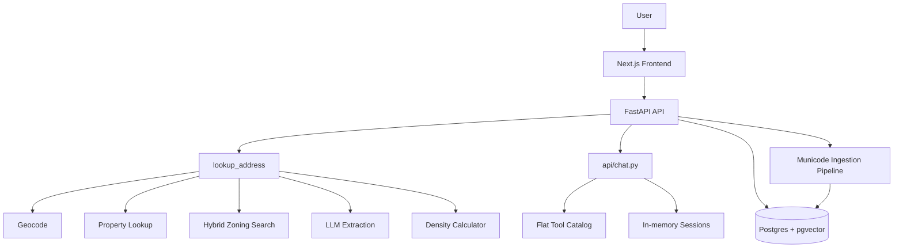
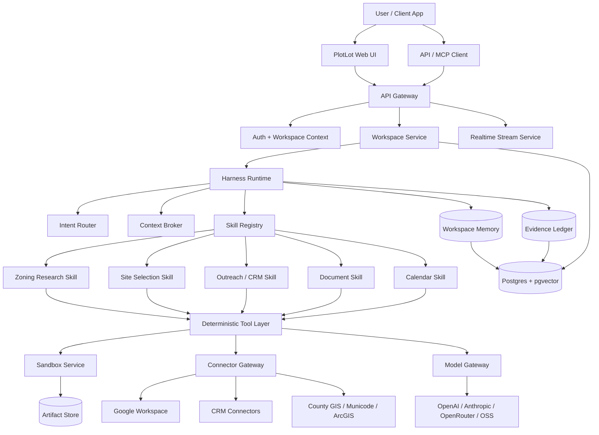
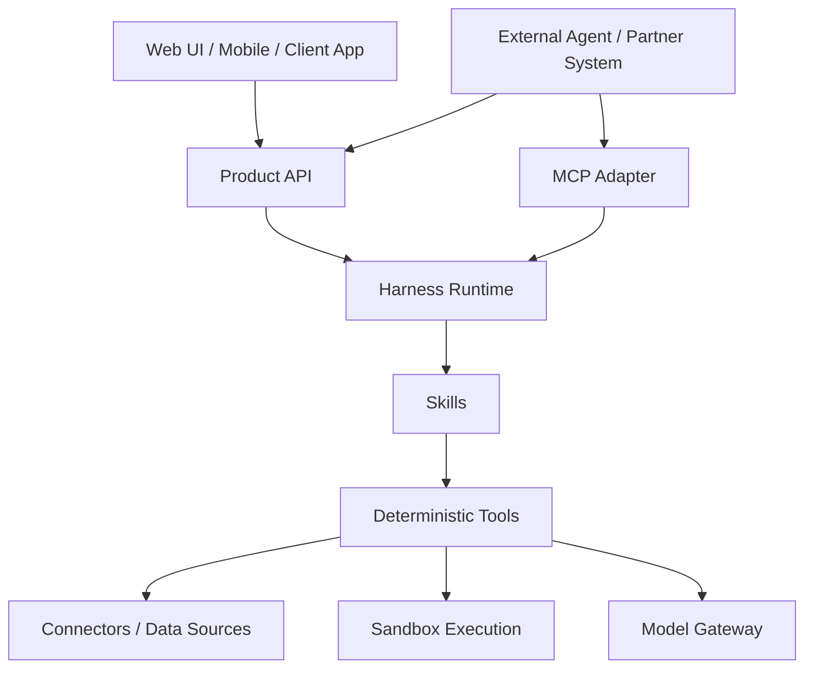
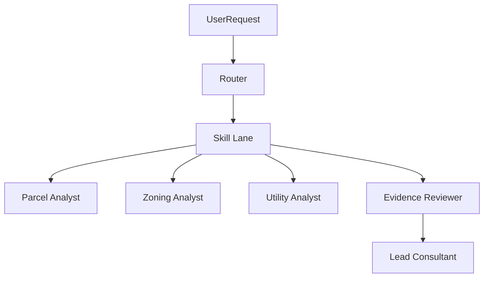
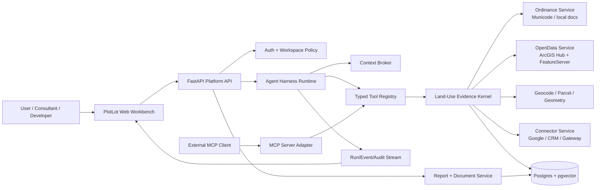
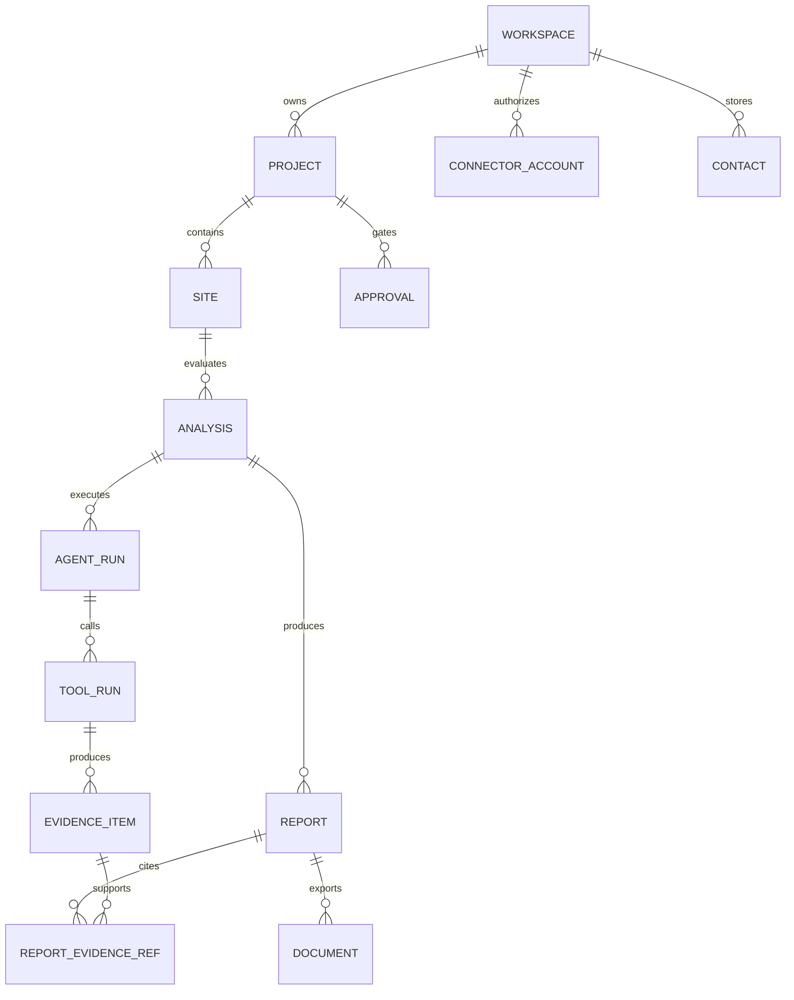
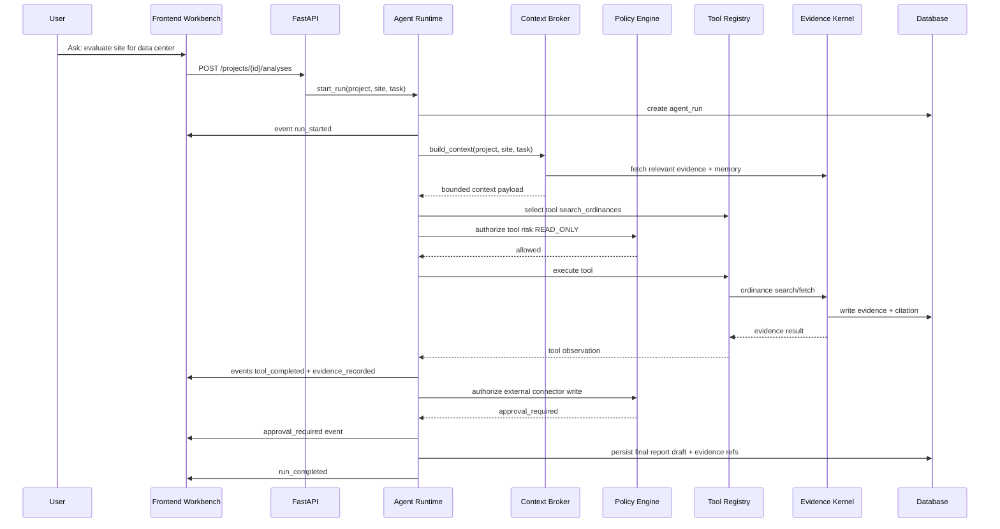
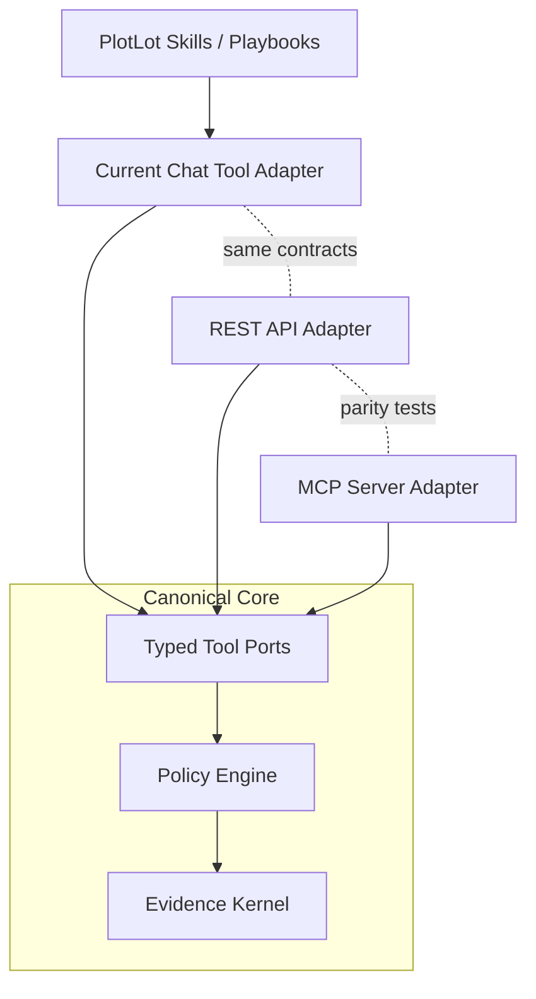
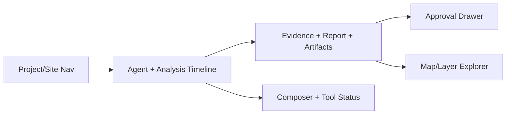
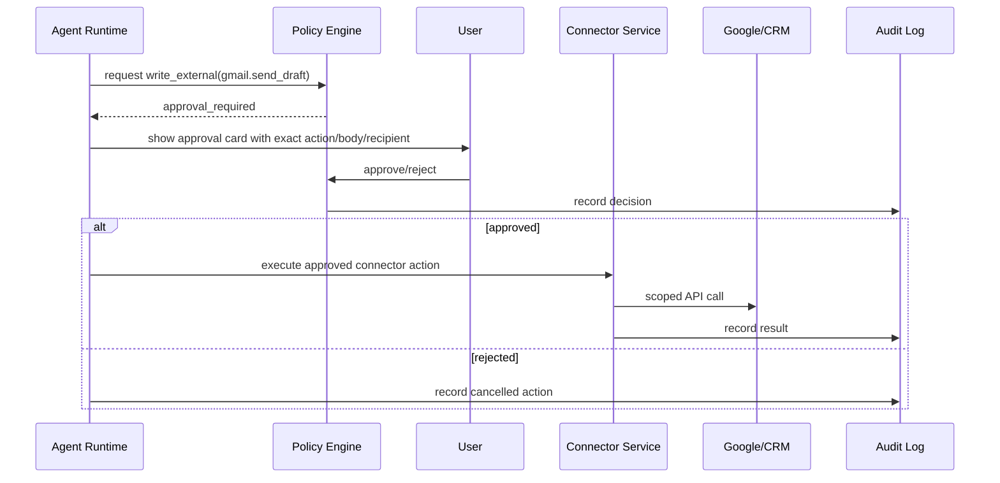

# Architecture — Agentic Land-Use and Site-Feasibility Consultant Harness

- Date: 2026-04-30
- Branch: `feature/opencode-visual-ralph`
- Related PRD (execution slice): `.omx/plans/prd-plotlot-workspace-harness.md`
- Related test spec: `.omx/plans/test-spec-plotlot-workspace-harness.md`
- North-star product framing: `docs/prd/2026-04-30-plotlot-agentic-land-use-harness.md`
- Research trace: `docs/prd/2026-04-30-agentic-research-trace.md`
- Connector contracts: `docs/connector-contracts/*`

## 1. Executive recommendation

PlotLot should implement an agentic land-use harness by separating **domain evidence services** from **transport adapters**.

The durable architecture:

```text
Domain connectors -> Evidence kernel -> Agent tool contracts -> API + MCP + skills + frontend workbench
```

This avoids a false API-vs-MCP choice:

- API is the product and integration boundary.
- MCP is the agent interoperability boundary.
- Tool contracts are the implementation boundary.
- Skills are workflow/playbook instructions above the contracts.

## 1.1 Current vs target pipeline (from the Ralph planning session)

### Current PlotLot pipeline (today)



### Target PlotLot harness (north star)



### API / MCP / Tools / Skills layering



### Router → lane → analyst pattern



## 2. High-level system



## 3. Product object model



Primary abstraction:

```text
project -> site -> analysis -> evidence -> report -> document
```

Secondary abstractions:

- agent run;
- tool run;
- approval;
- connector account;
- workspace contact/deal;
- memory/reflection.

## 4. Backend service boundaries

### 4.1 Agent Harness Runtime

Responsibilities:

- orchestrates tool-using analysis runs;
- emits run/tool/evidence/approval events;
- calls context broker before model turns;
- calls policy engine before tools;
- records tool results and evidence IDs;
- supports retries/reflections for Ralph-style loops;
- preserves compatibility with current chat/analyze endpoints.

Suggested module:

```text
src/plotlot/harness/runtime.py
src/plotlot/harness/events.py
src/plotlot/harness/tool_registry.py
src/plotlot/harness/policy.py
src/plotlot/harness/context.py
```

### 4.2 Land-Use Evidence Kernel

Responsibilities:

- normalizes evidence from ordinances, GIS, documents, web, and connectors;
- assigns evidence IDs;
- stores citations/provenance;
- exposes typed read APIs for reports and agent context.

Suggested module:

```text
src/plotlot/land_use/evidence.py
src/plotlot/land_use/citations.py
src/plotlot/land_use/models.py
```

### 4.3 Ordinance Service

Responsibilities:

- wrap existing Municode discovery/search/fetch logic;
- support user-uploaded/local ordinance documents;
- provide citation-rich results;
- enforce rate/freshness/licensing policy.

Current repo touchpoints:

- `src/plotlot/ingestion/discovery.py`
- `src/plotlot/ingestion/scraper.py`
- `src/plotlot/pipeline/ingest.py`
- `src/plotlot/api/chat.py::_execute_municode_live_search`

Suggested module:

```text
src/plotlot/land_use/ordinances/service.py
src/plotlot/land_use/ordinances/ports.py
src/plotlot/land_use/ordinances/municode.py
```

### 4.4 OpenData / Geospatial Service

Responsibilities:

- discover ArcGIS Hub datasets;
- query FeatureServer/MapServer layers;
- map fields to canonical parcel/zoning/utility/environmental models;
- return evidence-rich layer/query results.

Current repo touchpoints:

- `src/plotlot/property/universal.py`
- `src/plotlot/property/hub_discovery.py`
- `src/plotlot/property/field_mapper.py`
- `src/plotlot/retrieval/property.py`
- `src/plotlot/retrieval/bulk_search.py`

Suggested module:

```text
src/plotlot/land_use/open_data/service.py
src/plotlot/land_use/open_data/arcgis.py
src/plotlot/land_use/open_data/field_mapping.py
```

### 4.5 Workspace/Project/Site Service

Responsibilities:

- CRUD for workspace/project/site/analysis;
- fork analyses;
- link reports/evidence to sites;
- enforce tenant isolation.

Suggested module:

```text
src/plotlot/workspaces/service.py
src/plotlot/workspaces/routes.py
src/plotlot/workspaces/models.py
```

### 4.6 Connector Service

Responsibilities:

- manage OAuth accounts/scopes;
- perform scoped reads/writes;
- draft external actions;
- require approval for external writes;
- audit every connector action.

Suggested module:

```text
src/plotlot/connectors/base.py
src/plotlot/connectors/google.py
src/plotlot/connectors/crm.py
src/plotlot/connectors/gateway.py
```

### 4.7 Report/Document Service

Responsibilities:

- compile evidence-backed report sections;
- generate PDFs/DOCX/Sheets/Docs;
- validate every material claim has evidence;
- support versioned documents.

Current repo touchpoints:

- `src/plotlot/api/documents.py`
- `src/plotlot/documents/*`
- `src/plotlot/clauses/*`

## 5. Agent action flow



## 6. API/MCP adapter architecture



### Adapter rule

Do not duplicate tool logic inside REST, chat, or MCP adapters. Adapters should validate transport input, call the same core port, and serialize the same normalized output.

## 7. Proposed Python contracts

### 7.1 Evidence and citations

```python
from __future__ import annotations

from datetime import datetime
from enum import StrEnum
from typing import Any, Literal
from pydantic import BaseModel, Field, HttpUrl


class SourceType(StrEnum):
    ORDINANCE = "ordinance"
    ARCGIS_LAYER = "arcgis_layer"
    COUNTY_RECORD = "county_record"
    WEB_PAGE = "web_page"
    USER_DOCUMENT = "user_document"
    CONNECTOR_DOCUMENT = "connector_document"


class EvidenceConfidence(StrEnum):
    HIGH = "high"
    MEDIUM = "medium"
    LOW = "low"
    UNKNOWN = "unknown"


class EvidenceCitation(BaseModel):
    source_type: SourceType
    title: str
    url: HttpUrl | None = None
    jurisdiction: str | None = None
    path: list[str] = Field(default_factory=list)
    retrieved_at: datetime
    publisher: str | None = None
    legal_caveat: str | None = None
    raw_source_hash: str | None = None


class EvidenceItem(BaseModel):
    id: str
    workspace_id: str
    project_id: str
    site_id: str | None = None
    analysis_id: str | None = None
    tool_run_id: str | None = None
    claim_key: str
    value: dict[str, Any]
    source_type: SourceType
    tool_name: str
    confidence: EvidenceConfidence
    citation: EvidenceCitation
    retrieved_at: datetime
```

### 7.2 Tool context and policy

```python
from enum import StrEnum
from pydantic import BaseModel


class ToolRiskClass(StrEnum):
    READ_ONLY = "read_only"
    EXPENSIVE_READ = "expensive_read"
    WRITE_INTERNAL = "write_internal"
    WRITE_EXTERNAL = "write_external"
    EXECUTION = "execution"


class ToolContext(BaseModel):
    workspace_id: str
    project_id: str | None = None
    site_id: str | None = None
    analysis_id: str | None = None
    actor_user_id: str
    run_id: str
    risk_budget_cents: int = 0
    live_network_allowed: bool = False


class PolicyDecision(BaseModel):
    allowed: bool
    approval_required: bool = False
    reason: str
    approval_id: str | None = None
```

### 7.3 Ordinance port

```python
from pydantic import BaseModel


class OrdinanceJurisdiction(BaseModel):
    state: str
    county: str | None = None
    municipality: str | None = None


class OrdinanceSearchArgs(BaseModel):
    jurisdiction: OrdinanceJurisdiction
    query: str
    limit: int = 8
    include_text_snippets: bool = True


class OrdinanceSearchResult(BaseModel):
    section_id: str | None
    heading: str
    path: list[str]
    snippet: str
    citation: EvidenceCitation
    evidence_id: str | None = None


class OrdinanceToolPort:
    risk_class = ToolRiskClass.READ_ONLY

    async def search(
        self,
        args: OrdinanceSearchArgs,
        ctx: ToolContext,
    ) -> list[OrdinanceSearchResult]:
        ...

    async def fetch_section(
        self,
        jurisdiction: OrdinanceJurisdiction,
        section_id: str,
        ctx: ToolContext,
    ) -> OrdinanceSearchResult:
        ...
```

### 7.4 OpenData port

```python
class LayerCandidate(BaseModel):
    id: str
    title: str
    source_url: str
    service_url: str
    layer_id: int | None = None
    layer_type: Literal["parcel", "zoning", "land_use", "utility", "environment", "unknown"]
    publisher: str | None = None
    update_frequency: str | None = None
    field_mapping_confidence: EvidenceConfidence = EvidenceConfidence.UNKNOWN
    citation: EvidenceCitation


class PropertyLayerQuery(BaseModel):
    county: str
    state: str
    address: str | None = None
    apn: str | None = None
    owner: str | None = None
    bbox: tuple[float, float, float, float] | None = None
    out_fields: list[str] = Field(default_factory=lambda: ["*"])
    limit: int = 50


class OpenDataToolPort:
    risk_class = ToolRiskClass.READ_ONLY

    async def discover_layers(
        self,
        county: str,
        state: str,
        layer_type: str,
        ctx: ToolContext,
    ) -> list[LayerCandidate]:
        ...

    async def query_property_layer(
        self,
        args: PropertyLayerQuery,
        ctx: ToolContext,
    ) -> list[EvidenceItem]:
        ...
```

### 7.4 Connector tool ports (draft + approval)

Connectors must be expressed as **typed tool ports** with explicit risk classes. The default policy is:

- draft/prepare actions: `WRITE_INTERNAL` (allowed when allowlisted; no external side effects)
- commit/send actions: `WRITE_EXTERNAL` (requires explicit approval)

Example contract sketches:

```python
from enum import StrEnum
from pydantic import BaseModel, Field


class ConnectorProvider(StrEnum):
    GOOGLE_WORKSPACE = "google_workspace"
    GMAIL = "gmail"
    GOOGLE_CALENDAR = "google_calendar"
    CRM = "crm"


class ConnectorAccountStatus(StrEnum):
    CONNECTED = "connected"
    MISSING = "missing"
    LIMITED = "limited"
    ERROR = "error"


class ConnectorAccount(BaseModel):
    id: str
    provider: ConnectorProvider
    scopes: list[str] = Field(default_factory=list)
    status: ConnectorAccountStatus
    label: str | None = None


class DraftEmailArgs(BaseModel):
    to: list[str]
    subject: str
    body: str
    evidence_ids: list[str] = Field(default_factory=list)


class DraftEmailResult(BaseModel):
    draft_id: str
    preview: str


class GmailSendDraftArgs(BaseModel):
    draft_id: str


class ConnectorToolPort:
    async def draft_email(self, args: DraftEmailArgs, ctx: ToolContext) -> DraftEmailResult:
        ...

    async def gmail_send_draft(self, args: GmailSendDraftArgs, ctx: ToolContext) -> dict:
        # WRITE_EXTERNAL — requires approval + connector account readiness
        ...
```

## 8. REST route sketch

```python
from fastapi import APIRouter, Depends

router = APIRouter(prefix="/api/v1")


@router.post("/projects/{project_id}/sites/{site_id}/analyses")
async def create_analysis(project_id: str, site_id: str, req: CreateAnalysisRequest):
    return await harness_runtime.start_run(project_id=project_id, site_id=site_id, task=req.task)


@router.post("/tools/search-ordinances")
async def search_ordinances(req: OrdinanceSearchArgs, ctx: ToolContext = Depends(tool_context)):
    return await ordinance_tool.search(req, ctx)


@router.post("/tools/discover-open-data-layers")
async def discover_open_data_layers(req: DiscoverLayersRequest, ctx: ToolContext = Depends(tool_context)):
    return await open_data_tool.discover_layers(req.county, req.state, req.layer_type, ctx)


@router.get("/analyses/{analysis_id}/evidence")
async def list_evidence(analysis_id: str):
    return await evidence_service.list_for_analysis(analysis_id)


@router.get("/connectors/providers")
async def list_connector_providers():
    return [{"id": "google_workspace"}, {"id": "gmail"}, {"id": "google_calendar"}, {"id": "crm"}]


@router.get("/connectors/accounts")
async def list_connector_accounts(workspace_id: str):
    return await connector_service.list_accounts(workspace_id)


@router.post("/tools/draft-email")
async def draft_email(req: DraftEmailArgs, ctx: ToolContext = Depends(tool_context)):
    return await connector_tool.draft_email(req, ctx)


@router.post("/tools/gmail-send-draft")
async def gmail_send_draft(req: GmailSendDraftArgs, ctx: ToolContext = Depends(tool_context)):
    # Will return approval_required unless ctx includes an approved approval_id.
    return await connector_tool.gmail_send_draft(req, ctx)


@router.post("/approvals/{approval_id}/decision")
async def decide_approval(approval_id: str, body: ApprovalDecisionRequest):
    return await approvals_service.decide(approval_id, body)
```

## 9. MCP adapter sketch

MCP should expose the same ports. Example conceptual mapping:

```python
# transport-specific pseudo-code; exact MCP SDK can be chosen during implementation

@mcp.tool(name="plotlot.search_ordinances")
async def mcp_search_ordinances(jurisdiction: dict, query: str, limit: int = 8):
    ctx = mcp_tool_context(read_only=True)
    args = OrdinanceSearchArgs(jurisdiction=OrdinanceJurisdiction(**jurisdiction), query=query, limit=limit)
    return [result.model_dump(mode="json") for result in await ordinance_tool.search(args, ctx)]


@mcp.tool(name="plotlot.discover_open_data_layers")
async def mcp_discover_open_data_layers(county: str, state: str, layer_type: str = "parcel"):
    ctx = mcp_tool_context(read_only=True)
    return [layer.model_dump(mode="json") for layer in await open_data_tool.discover_layers(county, state, layer_type, ctx)]


@mcp.tool(name="plotlot.draft_email")
async def mcp_draft_email(to: list[str], subject: str, body: str):
    ctx = mcp_tool_context(read_only=False)
    args = DraftEmailArgs(to=to, subject=subject, body=body)
    return (await connector_tool.draft_email(args, ctx)).model_dump(mode="json")


@mcp.tool(name="plotlot.gmail_send_draft")
async def mcp_gmail_send_draft(draft_id: str):
    ctx = mcp_tool_context(read_only=False)
    args = GmailSendDraftArgs(draft_id=draft_id)
    return await connector_tool.gmail_send_draft(args, ctx)
```

MCP write tools should either be omitted from default config or return an approval-required envelope:

```json
{
  "status": "approval_required",
  "approval_id": "apr_...",
  "message": "Creating a CRM note is an external write and requires approval."
}
```

## 10. Skill/playbook shape

Skills should orchestrate tools, not replace them.

Example `data_center_siting.yaml`:

```yaml
id: data_center_siting_screen
version: 0.1.0
purpose: Evaluate whether a site is viable for data-center due diligence.
required_tools:
  - geocode_address
  - lookup_property_info
  - search_ordinances
  - discover_open_data_layers
  - query_property_layer
  - web_search
required_evidence:
  - parcel_identity
  - zoning_district
  - permitted_or_conditional_use
  - power_or_substation_proximity
  - water_or_sewer_availability
  - flood_or_wetlands_constraint
  - ownership
  - entitlement_unknowns
output:
  - site_scorecard
  - risks_and_unknowns
  - cited_recommendation
write_actions:
  default: approval_required
```

## 11. Database migration sketch

Prefer additive tables first; do not rewrite existing report/cache tables until the harness seam is stable.

```sql
CREATE TABLE workspaces (
  id TEXT PRIMARY KEY,
  name TEXT NOT NULL,
  created_at TIMESTAMPTZ NOT NULL DEFAULT now(),
  updated_at TIMESTAMPTZ NOT NULL DEFAULT now()
);

CREATE TABLE projects (
  id TEXT PRIMARY KEY,
  workspace_id TEXT NOT NULL REFERENCES workspaces(id),
  name TEXT NOT NULL,
  status TEXT NOT NULL DEFAULT 'active',
  created_at TIMESTAMPTZ NOT NULL DEFAULT now(),
  updated_at TIMESTAMPTZ NOT NULL DEFAULT now()
);

CREATE TABLE sites (
  id TEXT PRIMARY KEY,
  workspace_id TEXT NOT NULL REFERENCES workspaces(id),
  project_id TEXT NOT NULL REFERENCES projects(id),
  label TEXT NOT NULL,
  address TEXT,
  county TEXT,
  state TEXT,
  geometry_json JSONB,
  created_at TIMESTAMPTZ NOT NULL DEFAULT now()
);

CREATE TABLE analyses (
  id TEXT PRIMARY KEY,
  workspace_id TEXT NOT NULL REFERENCES workspaces(id),
  project_id TEXT NOT NULL REFERENCES projects(id),
  site_id TEXT REFERENCES sites(id),
  task TEXT NOT NULL,
  status TEXT NOT NULL,
  created_at TIMESTAMPTZ NOT NULL DEFAULT now(),
  completed_at TIMESTAMPTZ
);

CREATE TABLE agent_runs (
  id TEXT PRIMARY KEY,
  workspace_id TEXT NOT NULL REFERENCES workspaces(id),
  project_id TEXT REFERENCES projects(id),
  site_id TEXT REFERENCES sites(id),
  analysis_id TEXT REFERENCES analyses(id),
  model_provider TEXT,
  model_name TEXT,
  status TEXT NOT NULL,
  started_at TIMESTAMPTZ NOT NULL DEFAULT now(),
  completed_at TIMESTAMPTZ
);

CREATE TABLE tool_runs (
  id TEXT PRIMARY KEY,
  agent_run_id TEXT NOT NULL REFERENCES agent_runs(id),
  tool_name TEXT NOT NULL,
  risk_class TEXT NOT NULL,
  input_json JSONB NOT NULL,
  output_json JSONB,
  status TEXT NOT NULL,
  policy_decision_json JSONB,
  started_at TIMESTAMPTZ NOT NULL DEFAULT now(),
  completed_at TIMESTAMPTZ
);

CREATE TABLE evidence_items (
  id TEXT PRIMARY KEY,
  workspace_id TEXT NOT NULL REFERENCES workspaces(id),
  project_id TEXT NOT NULL REFERENCES projects(id),
  site_id TEXT REFERENCES sites(id),
  analysis_id TEXT REFERENCES analyses(id),
  tool_run_id TEXT REFERENCES tool_runs(id),
  claim_key TEXT NOT NULL,
  source_type TEXT NOT NULL,
  tool_name TEXT NOT NULL,
  confidence TEXT NOT NULL,
  value_json JSONB NOT NULL,
  citation_json JSONB NOT NULL,
  raw_source_hash TEXT,
  retrieved_at TIMESTAMPTZ NOT NULL,
  created_at TIMESTAMPTZ NOT NULL DEFAULT now()
);

CREATE TABLE reports (
  id TEXT PRIMARY KEY,
  workspace_id TEXT NOT NULL REFERENCES workspaces(id),
  project_id TEXT NOT NULL REFERENCES projects(id),
  site_id TEXT REFERENCES sites(id),
  analysis_id TEXT REFERENCES analyses(id),
  title TEXT NOT NULL,
  status TEXT NOT NULL,
  body_json JSONB NOT NULL,
  created_at TIMESTAMPTZ NOT NULL DEFAULT now()
);

CREATE TABLE report_evidence_refs (
  report_id TEXT NOT NULL REFERENCES reports(id),
  evidence_id TEXT NOT NULL REFERENCES evidence_items(id),
  claim_key TEXT NOT NULL,
  PRIMARY KEY (report_id, evidence_id, claim_key)
);

CREATE TABLE approvals (
  id TEXT PRIMARY KEY,
  workspace_id TEXT NOT NULL REFERENCES workspaces(id),
  project_id TEXT REFERENCES projects(id),
  agent_run_id TEXT REFERENCES agent_runs(id),
  tool_run_id TEXT REFERENCES tool_runs(id),
  risk_class TEXT NOT NULL,
  action_summary TEXT NOT NULL,
  status TEXT NOT NULL DEFAULT 'pending',
  requested_at TIMESTAMPTZ NOT NULL DEFAULT now(),
  decided_at TIMESTAMPTZ,
  decided_by TEXT
);

CREATE TABLE connector_accounts (
  id TEXT PRIMARY KEY,
  workspace_id TEXT NOT NULL REFERENCES workspaces(id),
  provider TEXT NOT NULL,
  account_label TEXT,
  scopes TEXT[] NOT NULL DEFAULT '{}',
  status TEXT NOT NULL,
  token_ref TEXT NOT NULL,
  created_at TIMESTAMPTZ NOT NULL DEFAULT now()
);
```

## 12. Frontend route/component tree

PlotLot uses Next.js App Router. Add the workbench without breaking `/` lookup/agent.

```text
frontend/src/app/
  page.tsx                         # existing lookup/agent home remains
  workspaces/
    page.tsx                       # workspace picker/list
    [workspaceId]/
      layout.tsx                   # workbench shell
      projects/
        page.tsx                   # project list
        [projectId]/
          page.tsx                 # project overview
          sites/
            [siteId]/
              page.tsx             # site dashboard
              analyses/
                [analysisId]/
                  page.tsx         # analysis run + evidence + report

frontend/src/components/workbench/
  WorkbenchShell.tsx
  ProjectNav.tsx
  SiteSummaryPanel.tsx
  AnalysisTimeline.tsx
  ToolRunCard.tsx
  EvidenceRail.tsx
  EvidenceCard.tsx
  ReportBuilder.tsx
  ApprovalPanel.tsx
  ConnectorStatus.tsx
  MapLayerExplorer.tsx
  ArtifactPanel.tsx
```

### UI layout



## 13. Event contract

SSE or websocket events should have stable envelopes:

```json
{
  "type": "tool_completed",
  "run_id": "run_123",
  "analysis_id": "ana_123",
  "timestamp": "2026-04-30T14:00:00Z",
  "payload": {
    "tool_run_id": "tool_123",
    "tool_name": "search_ordinances",
    "status": "completed",
    "evidence_ids": ["ev_123"],
    "summary": "Found 3 ordinance sections for parking requirements."
  }
}
```

Required event types:

- `run_started`
- `context_built`
- `tool_started`
- `tool_completed`
- `tool_failed`
- `evidence_recorded`
- `approval_required`
- `approval_decision`
- `report_section_created`
- `run_completed`
- `run_failed`

## 14. Connector security contract



Rules:

- Store secret tokens only in encrypted/managed secret storage; DB stores token references.
- Show exact external-write payload before approval.
- Separate draft creation from send/update operations.
- Treat remote gateways as execution-risk tools.
- External source text must never grant itself permission to use tools.

## 15. Municode/OpenData implementation detail

### Municode

Current code observes Municode endpoints, but productization needs stricter boundaries:

- use official/licensed access where available;
- respect terms/rate limits/robots;
- store source snippets and citations, not uncontrolled bulk republication;
- treat online code as informational unless verified against official municipality records;
- cache with freshness metadata and invalidation.

Normalized result:

```json
{
  "section_id": "node_abc",
  "jurisdiction": "Miami-Dade County, FL",
  "path": ["Code of Ordinances", "Chapter 33", "Zoning", "Parking"],
  "heading": "Off-street parking requirements",
  "snippet": "...",
  "citation": {
    "source_type": "ordinance",
    "publisher": "Municode/CivicPlus",
    "url": "https://library.municode.com/...",
    "retrieved_at": "2026-04-30T14:00:00Z",
    "legal_caveat": "Online code may not be the official/current copy; verify with municipality before action."
  }
}
```

### OpenData / ArcGIS

ArcGIS services are already a strong fit for APIs because FeatureServer/MapServer query endpoints return structured JSON and have discoverable layers/fields.

Normalized result:

```json
{
  "layer": {
    "title": "Parcels",
    "service_url": "https://.../FeatureServer/0",
    "layer_type": "parcel",
    "publisher": "County Property Appraiser"
  },
  "query": {
    "where": "SITE_ADDR LIKE '%MAIN%'",
    "out_fields": ["FOLIO", "OWNER", "SITE_ADDR", "ZONING"],
    "return_geometry": true
  },
  "records": [
    {
      "canonical": {
        "parcel_id": "...",
        "owner": "...",
        "zoning": "..."
      },
      "raw_ref": "sha256:...",
      "evidence_id": "ev_..."
    }
  ]
}
```

## 16. Context-engineering design

The agent context should be built in layers:

```text
1. System policy and domain role
2. Workspace/project/site summary
3. Current task and user constraints
4. Top evidence IDs + snippets
5. Tool affordance summary
6. Prior run reflections/reviewer notes
7. Unknowns and required citations
```

Context broker rules:

- compress old runs into claim/evidence summaries;
- include raw source text only when necessary;
- always label external source text;
- separate assumptions from facts;
- prefer evidence IDs over long copied excerpts;
- include missing-data notes to prevent hallucination.

## 17. Evaluation and observability

Every run should be replayable enough to answer:

- What did the user ask?
- What context did the model receive?
- Which tools were available?
- Which tools were called and with what args?
- Which evidence was created?
- Which report claims cite which evidence?
- Which actions required approval?
- Which live services failed/degraded?

Metrics:

- citation coverage rate;
- uncited material claim count;
- tool success/failure rate;
- evidence freshness distribution;
- report acceptance/edit rate;
- approval requested/approved/rejected counts;
- gold-case pass rate;
- live dependency degradation rate.

## 18. Local implementation sequence

1. Start from seeded fixture `tests/golden/land_use_cases.json`.
2. Add `land_use` evidence models and fixtures.
3. Wrap `search_municode_live` and `discover_open_data_layers` behind typed ports.
4. Add policy/risk metadata to chat tools.
5. Persist evidence IDs from tool calls.
6. Add workspace/project/site/analysis tables/routes behind feature flag.
7. Add API/MCP parity tests.
8. Add workbench route shell and fixture-driven UI tests.
9. Add live e2e only after deterministic tests pass and readiness groups are available.

## 19. Source references reviewed

- Kimi Web UI docs: https://moonshotai.github.io/kimi-cli/en/reference/kimi-web.html
- Kimi web source tree: https://github.com/MoonshotAI/kimi-cli/tree/main/web
- pi-mono web-ui source/readme: https://github.com/badlogic/pi-mono/tree/main/packages/web-ui
- MCP introduction: https://modelcontextprotocol.io/docs/getting-started/intro
- ArcGIS REST Query docs: https://developers.arcgis.com/rest/services-reference/enterprise/query-feature-service/
- ArcGIS dataset discovery overview: https://developers.arcgis.com/documentation/mapping-and-location-services/datasets/
- Municode Library: https://library.municode.com/
- Municode Terms of Use: https://library.municode.com/termsofuse.htm
- Context Engineering survey: https://arxiv.org/abs/2507.13334
- LLM Autonomous Agents survey: https://arxiv.org/abs/2308.11432
- ReAct: https://arxiv.org/abs/2210.03629
- Toolformer: https://arxiv.org/abs/2302.04761
- Reflexion: https://arxiv.org/abs/2303.11366
- MRKL Systems: https://arxiv.org/abs/2205.00445
